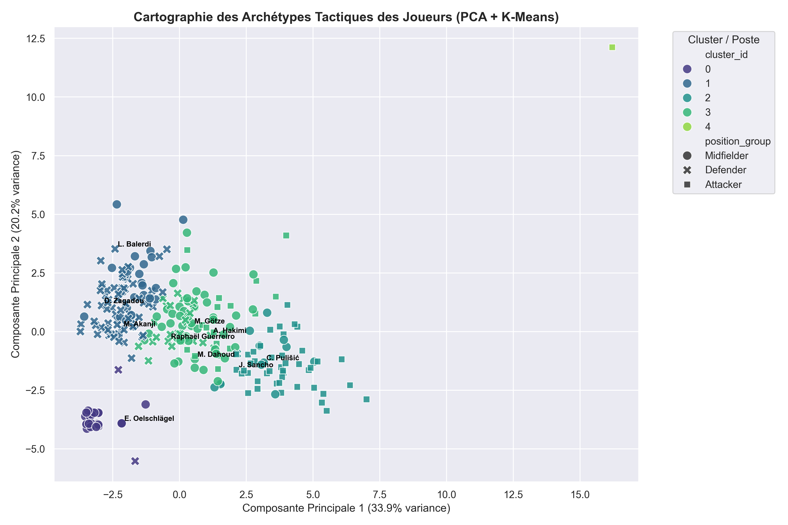

<div align="center">

# ⚽ Machine Learning Football Scouting & Analytics Engine

[](https://www.python.org/)
[](https://scikit-learn.org/)
[](https://fastapi.tiangolo.com/)
[](https://nextjs.org/)
[](https://www.prisma.io/)
[](https://www.sqlite.org/)

An end-to-end, professional-grade football scouting and analytics platform designed for modern, data-driven recruitment. Moving beyond simple web interfaces, this engine processes raw match statistics into high-dimensional tactical embeddings, probabilistic soft clusters, outlier gem detection, and contextual similarity models.

</div>

---

## 📖 Engine Overview & Pipeline Execution Flow

The machine learning engine operates as a sequential execution pipeline, beginning with `quality_check.py` to enforce statistical validation rules and schema compliance before `load_to_postgres.py` ingests the cleaned player data into the SQLite database. Dimensionality reduction and hard segmentation are executed by `train_player_clustering.py`, which applies PCA and K-Means to map players into five core tactical archetypes, while `detect_scouting_outliers.py` utilizes an Isolation Forest algorithm to identify statistical anomalies and hidden scouting gems. To power replacement search functionality, `build_player_similarities.py` computes intra-cluster cosine similarity scores across matched tactical profiles. For probabilistic modeling, `train_advanced_ml.py` converts skewed per-90 metrics into percentile ranks via `QuantileTransformer` and fits Gaussian Mixture Models (GMM) to output hybrid role probabilities, which is mirrored by `train_umap_contextual.py` to calculate positional Z-scores and map non-linear tactical manifolds using UMAP and t-SNE embeddings. Web visualization is driven by `app_dashboard.py` alongside a Next.js web application consuming FastAPI REST endpoints in real time.

---

## 📊 Tactical Archetype Mapping

<div align="center">
  
  <p><i>Figure 1: Spatial 2D projection using <b>PCA (54.1% Explained Variance)</b> and <b>K-Means Clustering ($K=5$)</b>. Outfield players automatically segment into distinct tactical profiles (defenders on the left, playmakers/attackers on the right), while extreme outliers (e.g., Cyril Ngonge) are visually isolated.</i></p>
</div>

---

## 📌 Core Architecture & Machine Learning Modules

* **Data Quality & Validation (`scripts/quality_check.py`)**: Pre-ingestion validation rules ensuring statistical schema compliance and data hygiene prior to SQLite database loading.
* **Percentile Rank Normalization (`QuantileTransformer`)**: Handles skewed football metrics by converting raw per-90 stats into equitable percentile ranks ($0.0$ to $1.0$).
* **Tactical Archetype Profiling (`scripts/train_player_clustering.py`)**: Reduces multi-metric dimensionality to principal components and segments players into $5$ core tactical archetypes via PCA + K-Means.
* **Soft Clustering & Hybrid Roles (`scripts/train_advanced_ml.py`)**: Computes probabilistic multi-cluster membership vectors $\sum_{k=1}^{K} P(\text{Cluster}_k \vert{} \text{Player}) = 1.0$ alongside model confidence scores using Gaussian Mixture Models.
* **Outlier & Gem Scouting (`scripts/detect_scouting_outliers.py`)**: Identifies high-value, unique statistical profiles and undervalued targets operating outside normal performance distributions using Isolation Forests.
* **Contextual Positional Embeddings (`scripts/train_umap_contextual.py`)**: Normalizes performance metrics strictly within positional groups (`position_group`) using Positional Z-Scores and projects non-linear tactical manifolds via UMAP / t-SNE.
* **Intra-Cluster Replacement Search (`scripts/build_player_similarities.py`)**: Cosine similarity engine calculated strictly within tactical clusters to deliver realistic replacement candidates.

---

## 🛠️ Tech Stack

* **Core Engine**: Python 3.10+
* **Database & ORM**: SQLite (`data/football_analytics.db`), SQLAlchemy, Prisma ORM
* **Data Science & ML**: Pandas, NumPy, Scikit-learn, UMAP-learn
* **Visualization**: Matplotlib, Seaborn, Plotly, Streamlit (`app_dashboard.py`)
* **Frontend & Web Backend**: Next.js 14, React, Tailwind CSS, FastAPI REST API

---

## 📁 Repository Structure

```text
football_analytics_project/
├── assests/                         # Static assets & media
├── config/                          # Application & pipeline configuration
├── data/
│   ├── processed/                   # Transformed datasets
│   ├── raw/                         # Ingested raw datasets
│   ├── reference/                   # Mappings & League metadata
│   ├── football_analytics.db        # Core SQLite Database
│   └── player_archetypes_pca.png    # PCA & K-Means Spatial Visualization
├── logs/                            # Pipeline execution & audit logs
├── prisma/                          # Prisma ORM schema & migrations
├── scripts/                         # Modular ML & data processing scripts
├── test/                            # Integration & unit test suites
├── web/                             # Next.js full-stack application
├── .env                             # Environment variables
├── .gitignore                       # Git exclusion rules
├── app_dashboard.py                 # Analytics dashboard interface
├── package.json                     # Node.js project configuration
├── package-lock.json                # Dependency lockfile
├── requirements.txt                 # Python dependencies
└── README.md                        # Project documentation
🚀 Getting Started
1. Installation
Clone the repository and install the Python environment dependencies:

PowerShell
cd Desktop\football_analytics_project
pip install -r requirements.txt
2. Step-by-Step Pipeline Execution
Execute the scripts in order to build the machine learning models and populate the SQLite database:

PowerShell
# 1. Quality Control & Database Ingestion
python scripts/quality_check.py
python scripts/load_to_postgres.py

# 2. Hard Clustering & Anomaly Detection
python scripts/train_player_clustering.py
python scripts/detect_scouting_outliers.py

# 3. Similarity Search & Advanced Embeddings
python scripts/build_player_similarities.py
python scripts/train_advanced_ml.py
python scripts/train_umap_contextual.py
3. One-Click Automated Pipeline Run
To execute the entire end-to-end data science pipeline in a single command in PowerShell:

The machine learning pipeline populates and maintains the following tables inside `data/football_analytics.db`:

| Table Name | Model / Purpose | Output Key Features |
| :--- | :--- | :--- |
| `players` | Ingestion Schema | `player_id`, `name`, `position_group`, `age` |
| `player_statistics` | Preprocessed Metrics | `goals_per90`, `key_passes_per90`, `dribbles_per90` |
| `player_clusters` | PCA + K-Means | `cluster_id`, `PCA1`, `PCA2` |
| `player_outliers` | Isolation Forest | `anomaly_score`, `is_outlier` |
| `player_similarities` | Cosine Similarity | `similar_player_id`, `similarity_score`, `rank` |
| `player_gmm_clusters` | Quantile + GMM | `primary_cluster`, `cluster_confidence`, `probabilities` |
| `player_umap_embeddings` | Positional Z-Score + UMAP | `UMAP_1`, `UMAP_2` |
🌐 FastAPI REST Integration
Serve the analytics outputs directly to the Next.js frontend or external tools via the REST API:

PowerShell
uvicorn scripts.api:app --reload --port 8000
Interactive OpenAPI Docs: http://localhost:8000/docs

Players JSON Endpoint: http://localhost:8000/api/players