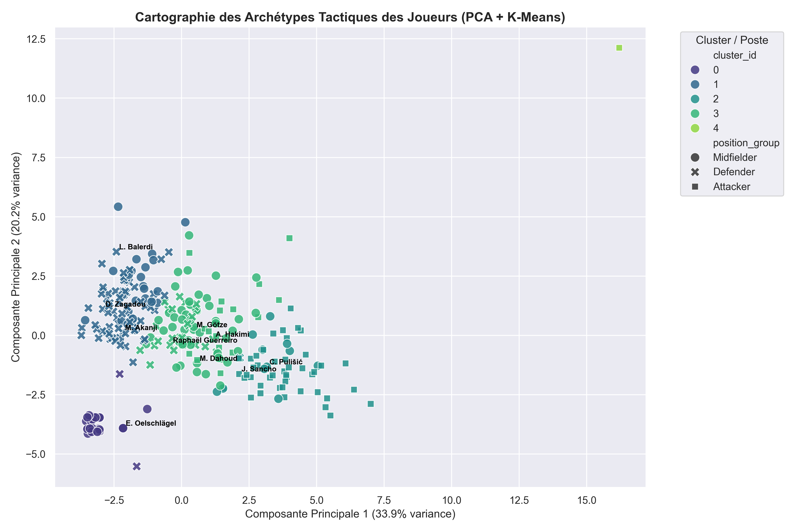

<div align="center">

# ⚽ Machine Learning Football Scouting & Analytics Engine

[](https://www.python.org/)
[](https://scikit-learn.org/)
[](https://fastapi.tiangolo.com/)
[](https://nextjs.org/)
[](https://www.prisma.io/)
[](https://www.sqlite.org/)

An end-to-end, professional-grade football scouting and analytics platform built for modern, data-driven recruitment. Moving beyond basic statistical filtering, this engine processes raw match data into high-dimensional tactical embeddings, probabilistic soft clusters, anomaly-based gem detection, and contextual similarity models.

</div>

---

## 📖 Pipeline Execution Flow

The engine operates as a sequential machine learning and ETL pipeline. Raw statistical data is transformed into actionable scouting intelligence through the following phases:

1. **Validation & Ingestion** (`quality_check.py` ➔ `load_to_postgres.py`)
   Enforces statistical validation rules and schema compliance before ingesting cleaned player data into the SQLite database.
2. **Hard Segmentation & Dimensionality Reduction** (`train_player_clustering.py`)
   Applies PCA and K-Means to map players into five core tactical archetypes based on their statistical profiles.
3. **Probabilistic Modeling & Soft Clustering** (`train_advanced_ml.py`)
   Normalizes skewed per-90 metrics via `QuantileTransformer` and fits Gaussian Mixture Models (GMM) to output hybrid role probabilities.
4. **Contextual Profiling & Similarity** (`train_umap_contextual.py` ➔ `build_player_similarities.py`)
   Calculates positional Z-scores and projects non-linear tactical manifolds using UMAP/t-SNE. Computes intra-cluster cosine similarity scores to power direct replacement searches.
5. **Anomaly & Gem Detection** (`detect_scouting_outliers.py`)
   Utilizes an Isolation Forest algorithm to identify statistical anomalies and isolate hidden scouting gems.
6. **Data Visualization** (`app_dashboard.py` & `web/`)
   Exposes insights via a Next.js web application consuming FastAPI REST endpoints, supported by a Streamlit analytics dashboard.

---

## 📊 Tactical Archetype Mapping

<div align="center">
  
  <p><i><b>Figure 1:</b> Spatial 2D projection using <b>PCA (54.1% Explained Variance)</b> and <b>K-Means Clustering (K=5)</b>. Illustrates the tactical progression from defensive profiles (left) to creative attackers (right), while isolating specialized roles and statistical outliers.</i></p>
</div>

---

## 📌 Machine Learning Modules

* **Data Quality Validator:** Enforces pre-ingestion schema compliance and data hygiene routines (`scripts/quality_check.py`).
* **Percentile Normalization:** Employs `QuantileTransformer` to handle heavily skewed football metrics, converting raw per-90 statistics into equitable percentile ranks (0.0 to 1.0).
* **Tactical Archetype Profiling:** Reduces multi-metric dimensionality via PCA and segments players into distinct tactical archetypes using K-Means (`scripts/train_player_clustering.py`).
* **Hybrid Role Modeling:** Calculates probabilistic multi-cluster membership vectors and model confidence scores using Gaussian Mixture Models (`scripts/train_advanced_ml.py`).
* **Scouting Outlier Detection:** Flags high-value, statistically unique profiles operating outside standard performance distributions using Isolation Forests (`scripts/detect_scouting_outliers.py`).
* **Contextual Positional Embeddings:** Normalizes performance strictly within positional cohorts using Positional Z-Scores, mapping complex tactical relationships via UMAP and t-SNE (`scripts/train_umap_contextual.py`).
* **Replacement Similarity Engine:** Leverages intra-cluster cosine similarity to generate highly realistic, tactically matched player replacement candidates (`scripts/build_player_similarities.py`).

---

## 🛠️ Tech Stack

| Domain | Technologies |
| :--- | :--- |
| **Core Engine** | Python 3.10+ |
| **Data Science & ML** | Pandas, NumPy, Scikit-learn, UMAP-learn |
| **Database & ORM** | SQLite (`football_analytics.db`), SQLAlchemy, Prisma ORM |
| **Backend API** | FastAPI |
| **Frontend & Visualization** | Next.js 14, React, Tailwind CSS, Matplotlib, Seaborn, Streamlit |

---

## 📁 Repository Structure

```text
football_analytics_project/
├── assets/                 
├── config/                  
├── data/
│   ├── processed/           
│   ├── raw/                 
│   ├── reference/           
│   ├── football_analytics.db 
│   └── player_archetypes_pca.png
├── logs/                    
├── prisma/                 
├── scripts/                 
├── test/                   
├── web/                    
├── app_dashboard.py         
├── package.json             
├── requirements.txt         
└── README.md                
